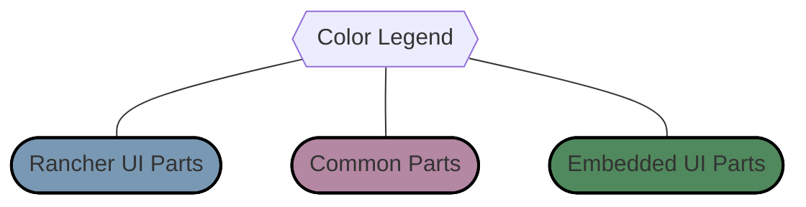
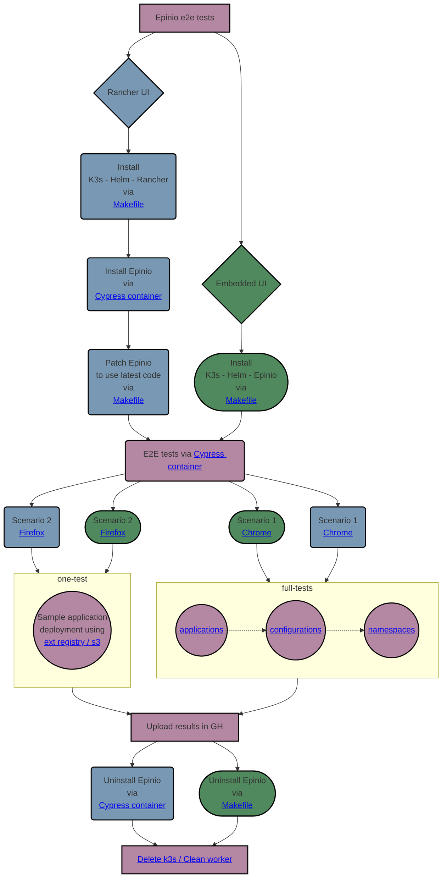

### Rancher UI E2E tests
[](https://github.com/epinio/epinio-end-to-end-tests/actions/workflows/scenario_1_chrome_rancher_ui.yml?query=branch%3Amain)
[](https://github.com/epinio/epinio-end-to-end-tests/actions/workflows/scenario_2_firefox_rancher_ui.yml?query=branch%3Amain)

### Standalone UI E2E tests
[](https://github.com/epinio/epinio-end-to-end-tests/actions/workflows/std_ui_latest_chrome.yml?query=branch%3Amain)
[](https://github.com/epinio/epinio-end-to-end-tests/actions/workflows/std_ui_latest_firefox.yml?query=branch%3Amain)

# epinio-end-to-end-tests

This repository contains all the files necessary to run Epinio end-to-end tests.</br>

The `cypress` directory contains the tests written using the
[Cypress](https://www.cypress.io/) testing framework.</br>

GitHub Actions CI is used to execute the tests every night.
Currently two scenarios are tested.

## Contents

- [Epinio-end-to-end-tests](#epinio-end-to-end-tests)
  - [Contents](#contents)
  - [Rancher UI and Epinio UI](#rancher-and-epinio-ui)
  - [Scenario 1 - Using Chrome](#scenario-1---using-chrome)
  - [Scenario 2 - Using Firefox](#scenario-2---using-firefox)
  - [Process explained in one chart](#process-explained-in-one-chart)

## Rancher UI and Epinio UI

The E2E tests are executed against both Rancher's UI and Epinio's UI.
Note that they have differences between them.</br>

Epinio is installed via Rancher when testing it against Rancher's UI.
For testing against its own UI, it is installed via its own Helm Chart instead.</br>

The tests use the main branches of [Epinio](https://github.com/epinio/epinio)
and [Epinio's Helm Chart](https://github.com/epinio/helm-charts).

## How To Quick-Start a development environment using k3d

:warning: __Attention__, this was only tested on Linux so far.

### Epinio UI

1. Clone the repository

```bash
git clone https://github.com/epinio/epinio-end-to-end-tests.git
```

2. Check that all dependencies are installed:

```bash
make check-dependencies
```

3. Create the cluster

```bash
make prepare-cluster
```

   Check the output and export the IP as the IP_ADDR variable (`export IP_ADDR=<IP>`).

4. Deploy Epinio

```bash
make deploy-epinio
```

5. Export variables for Cypress

```bash
export RANCHER_USER=admin RANCHER_PASSWORD=password RANCHER_URL=https://epinio.${IP_ADDR}.nip.io SYSTEM_DOMAIN=${IP_ADDR}.nip.io
```

6. Start Cypress GUI

```bash
make cypress-gui
```

## Scenario 1 - Using Chrome

In this scenario, Epinio is deployed in Rancher with default options and a basic UI test is then
performed using [menu.spec.ts](./cypress/integration/unit_tests/menu.spec.ts).
The underlying browser is Chrome.

<!-- You can check all the things we test directly in the [file](./cypress/integration/scenarios/with_default_options.spec.ts). -->

## Scenario 2 - Using Firefox

The second scenario is the same as the first, except it uses Firefox as the browser. </br>

TODO: Get back installation with S3 and external registry configuration within rancher installation.
Ref [Issue#236](https://github.com/epinio/epinio-end-to-end-tests/issues/236)

<!-- Second scenario tests Epinio installation with S3 and external registry configured. </br>
Unlike the first scenario, we only play a small bunch of [tests](./cypress/integration/scenarios/with_s3_and_external_registry.spec.ts). -->

## Process explained in one chart



---


