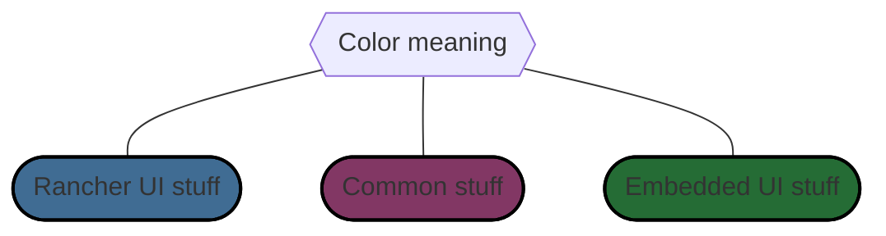
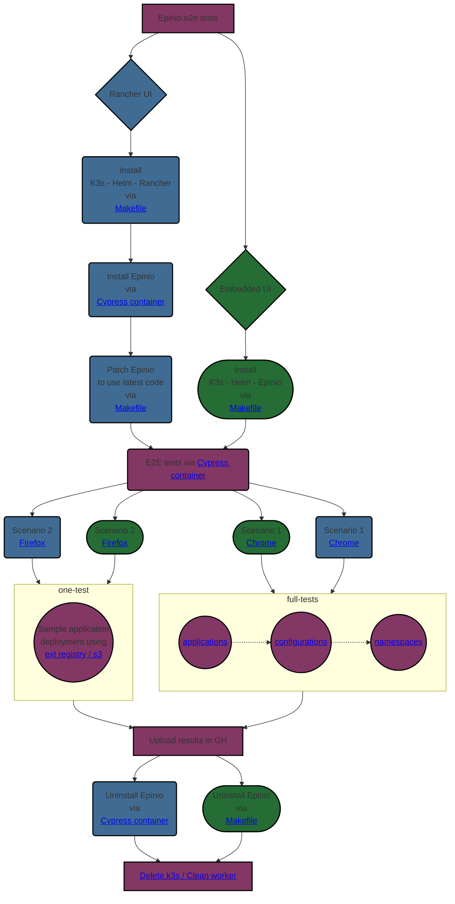

### Rancher UI E2E tests
[](https://github.com/epinio/epinio-end-to-end-tests/actions/workflows/scenario_1_chrome_rancher_ui.yml?query=branch%3Amain)
[](https://github.com/epinio/epinio-end-to-end-tests/actions/workflows/scenario_2_firefox_rancher_ui.yml?query=branch%3Amain)

### Standalone UI E2E tests
[](https://github.com/epinio/epinio-end-to-end-tests/actions/workflows/scenario_1_chrome_std_ui.yml?query=branch%3Amain)
[](https://github.com/epinio/epinio-end-to-end-tests/actions/workflows/scenario_2_firefox_std_ui.yml?query=branch%3Amain)

# epinio-end-to-end-tests
This repository contains all the files necessary to run Epinio end-to-end tests.</br>
In the cypress directory are stored the tests written using the [Cypress](https://www.cypress.io/) testing framework.</br>
Tests are executed every night in the CI. For now, two scenarios are tested.

## Contents

- [Epinio-end-to-end-tests](#epinio-end-to-end-tests)
  - [Contents](#contents)
  - [Rancher UI and Epinio UI](#rancher-and-epinio-ui)
  - [Scenario 1 - Using Chrome](#scenario-1---using-chrome)
  - [Scenario 2 - Using Firefox](#scenario-2---using-firefox)
  - [Process explained in one chart](#process-explained-in-one-chart)
## Rancher UI and Epinio UI
E2E tests are executed both on Rancher UI and Epinio UI but there is a difference between them.</br>
For the first one, Epinio is installed via Rancher while for Epinio UI, it is installed via Helm command line.</br>
The tests run with main branches of [epinio](https://github.com/epinio/epinio) and [epinio's helm chart](https://github.com/epinio/helm-charts).
## How to quickly start a dev env with k3d
__Attention__, it was only tested on Linux so far.
### Epinio UI

1. Clone the repo
```bash
git clone https://github.com/epinio/epinio-end-to-end-tests.git
```

2. Check if you got all dependencies installed:
```bash
make check-dependencies
```

3. Create the cluster
```bash
make prepare-cluster
```
Check the output and export the IP as the IP_ADDR variable (export IP_ADDR=<IP>).

4. Deploy Epinio
```bash
make deploy-epinio
```

5. Export variables for Cypress
```bash
export RANCHER_USER=admin RANCHER_PASSWORD=password RANCHER_URL=https://epinio.${IP_ADDR}.nip.io SYSTEM_DOMAIN=${IP_ADDR}.nip.io
```

6. Start Cypress GUI
```bash
make cypress-gui
```

## Scenario 1 - Using Chrome
In this first scenario, Epinio is deployed with default options. </br>
You can check all the things we test directly in the [file](./cypress/integration/scenarios/with_default_options.spec.ts).

## Scenario 2 - Using Firefox
Second scenario tests Epinio installation with S3 and external registry configured. </br>
Unlike the first scenario, we only play a small bunch of [tests](./cypress/integration/scenarios/with_s3_and_external_registry.spec.ts).

## Process explained in one chart

---

